  

  
  
  

  

  

  
  

  
  

  

  
  

  <picture>
    <source media="(prefers-color-scheme: dark)" srcset="https://raw.githubusercontent.com/Rithik-sharma12/Rithik-sharma12/output/github-snake-dark.svg" />
    
  </picture>

  

